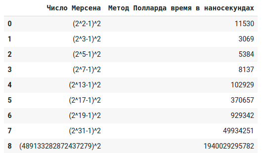
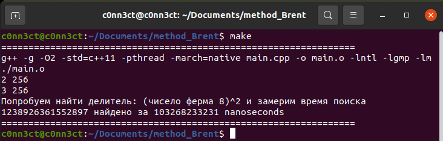
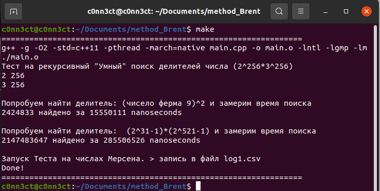

# method_Brent
Метод Брента 

Реализовано: 
	Метод Полларда
	Метод Брента 
	Метод Ферма
	Поиск простого через перебор до sqr(n)
	Замер времени поиска делителя
	Алгоритм факторизации из всех реализованных ранее методов (Метод Полларда, если не найден, то -> Метод Брента,  если нет, делится на 2? Если нет, то метод Ферма(так как он для нечетных чисел), иначе делится на 2) 

Структура файла log.csv:
	1 столбец: число для разложения
	2 столбец: время метода Полларда 
	3 столбец: время метода Брента_1 с goto 
	4 столбец: время метода Брента_2 без goto 


Результат замера Метода Полларда (Находится в файле log1.csv):




Пример выполнения:






Используется библиотека [NTL](https://github.com/libntl/ntl)

Установка: 
```shell

   % gunzip ntl-xxx.tar.gz
   % tar xf ntl-xxx.tar
   % cd ntl-xxx/src
   % ./configure 
   % make
   % make check
   % sudo make install

```

Компиляция и запуск программы:
```shell
make
```

Для удаления: 
```shell
make clean
```


